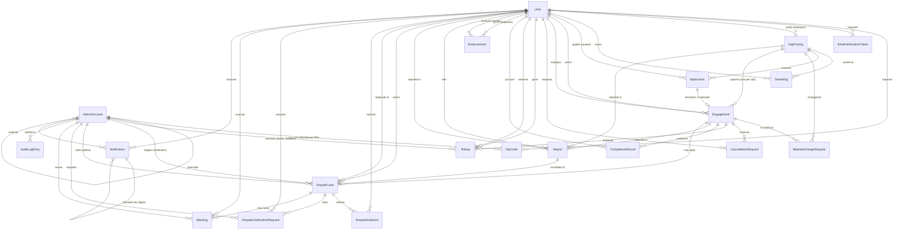

# YouthLink — Database Schema

The complete entity-relationship specification for YouthLink: **20 tables, 49 foreign keys**, covering every entity the requirements baseline implies. This is the design `prisma/schema.prisma` is built from, and the reference for why the schema looks the way it does.

## About this document

**The whole schema is designed up front, not grown per sprint.** Every table below lands in a single initial migration before feature work begins. This is deliberate — it means nobody is blocked waiting on someone else's tables, and it avoids a run of small migrations that each invalidate work already in progress.

**Changing the schema after that first migration requires telling the team.** If your work needs a table altered, notify everyone whose in-progress or planned work touches the affected table(s) _before_ making the change — not a silent local migration. This is part of the Definition of Done in [`CONTRIBUTING.md`](../CONTRIBUTING.md).

**How to read the tables.** Types use Prisma names (`String`, `Int`, `Boolean`, `DateTime`, `Decimal`, `Json`, `Enum`). Every field cites the requirement it exists to satisfy — look the ID up in [`requirements.md`](requirements.md). Constraints marked "app-level" are deliberately _not_ enforced in the database; enforce them in the API layer.

**Terminology.** `COMMUNITY_ENDORSER` is the code-facing name for the actor the requirements call **Community Verifier/Endorser**. They are the same role. The schema avoids "Verifier" because it reads like a privileged identity-checking role, and sits confusingly close to the real verification concepts nearby (`phoneVerifiedAt`, NIC handling, the KYC layer FR-ADM-04 anticipates). The actual role is a peer community member vouching for someone they personally know.

**Related documents:** [`requirements.md`](requirements.md) is the normative requirements baseline; [`product-overview.md`](product-overview.md) explains how the system works end to end.

> **Canonical source.** This file is derived from the team's schema design, which is maintained outside the repository. Don't change the design by editing this file alone — raise it with the team so both stay in step.

---

## 1. Identity & Access

### `User`

The single identity table for all three self-selected actor types (Youth Job-Seeker, Employer, Community Endorser). Kept as one table, not three, because the uniqueness rules that matter most (NIC, phone, email — FR-ACC-05) apply across all three actor types together, not per-role.

| Field                          | Type                  | Constraints                                     | Notes / Traceability                                                                                                  |
| ------------------------------ | --------------------- | ----------------------------------------------- | --------------------------------------------------------------------------------------------------------------------- |
| `id`                           | String                | PK                                              |                                                                                                                       |
| `role`                         | Enum(`ActorRole`)     | required                                        | FR-ACC-01                                                                                                             |
| `phone`                        | String                | required, partial-unique (see Uniqueness Notes) | Login credential + contact-reveal + dedup key (FR-ACC-05, FR-APPLY-07)                                                |
| `phoneVerifiedAt`              | DateTime              | nullable                                        | Set once OTP confirmed (FR-ACC-08)                                                                                    |
| `passwordHash`                 | String                | required                                        | bcrypt/argon2 only (NFR-SEC-01, FR-ACC-09)                                                                            |
| `failedLoginAttempts`          | Int                   | default 0                                       | Consecutive failed password attempts (NFR-SEC-02, FR-ACC-09)                                                          |
| `lockedUntil`                  | DateTime              | nullable                                        | Now + 15 min on the 5th consecutive failure (NFR-SEC-02)                                                              |
| `email`                        | String                | nullable, partial-unique                        | Optional recovery channel (FR-ACC-01)                                                                                 |
| `emailVerifiedAt`              | DateTime              | nullable                                        | FR-ACC-14                                                                                                             |
| `nicEncrypted`                 | String                | required, unique, encrypted at rest             | FR-ACC-04, NFR-SEC-03. Never verified, never age-derived                                                              |
| `nicLast4`                     | String(4)             | required                                        | Masked value shown back to the entering user (NFR-SEC-03)                                                             |
| `legalName`                    | String(100)           | required                                        | Display identity, never pseudonymous; editable post-signup (FR-PROF-01, FR-ACC-15)                                    |
| `birthdate`                    | Date                  | required                                        | Enforces the 18+ gate; explicitly _not_ derived from NIC (FR-ACC-03, FR-ACC-04)                                       |
| `postingAsType`                | Enum(`PostingAsType`) | nullable — Employer only                        | Current value; postings snapshot their own copy (FR-ACC-02, FR-ACC-16)                                                |
| `businessName`                 | String(100)           | nullable                                        | Required when `postingAsType = BUSINESS` (FR-ACC-02)                                                                  |
| `businessBio`                  | String(300)           | nullable                                        | FR-PROF-03, FR-POST-16                                                                                                |
| `bio`                          | String(300)           | nullable                                        | Youth Job-Seeker bio; pre-fills every application note (FR-PROF-03, FR-PROF-04)                                       |
| `bioPromptShownAt`             | DateTime              | nullable                                        | One-time nudge tracker (FR-ENDORSE-13)                                                                                |
| `endorsementSuggestionShownAt` | DateTime              | nullable                                        | One-time nudge tracker, fires after 3 unselected applications (FR-ENDORSE-14)                                         |
| `notifyUrgentOptIn`            | Boolean               | default `false`                                 | Opt-**in** (FR-NOTIF-01, FR-NOTIF-03)                                                                                 |
| `notifyNewGigOptOut`           | Boolean               | default `false`                                 | Opt-**out**-by-default (FR-NOTIF-02, FR-NOTIF-03)                                                                     |
| `tosAcceptedAt`                | DateTime              | required at signup completion                   | FR-ACC-19                                                                                                             |
| `accountStatus`                | Enum(`AccountStatus`) | default `PENDING_SIGNUP`                        | Registration writes `ACTIVE` directly — `PENDING_SIGNUP` is currently never persisted. See FR-ACC-06's amendment note |
| `signupExpiresAt`              | DateTime              | nullable                                        | **Currently unused.** Supported a staged signup that FR-ACC-01 no longer performs; see FR-ACC-06's amendment note     |
| `endorsementCode`              | String(6)             | unique, nullable                                | **Alphanumeric**, not numeric — deliberately distinct from the 6-digit OTP and checkpoint codes (FR-ENDORSE-02)       |
| `firstRatingReceivedAt`        | DateTime              | nullable                                        | Once set, endorsement eligibility closes permanently and never reopens (FR-ENDORSE-05)                                |
| `autoHiddenAt`                 | DateTime              | nullable                                        | Set on the 3rd independent report against this profile (FR-DISPUTE-02)                                                |
| `suspendedAt`                  | DateTime              | nullable                                        | FR-ADM-03                                                                                                             |
| `suspensionReason`             | String                | nullable                                        |                                                                                                                       |
| `deletedAt`                    | DateTime              | nullable                                        | Soft-delete marker (FR-ACC-17, NFR-PRIV-03)                                                                           |
| `createdAt` / `updatedAt`      | DateTime              |                                                 |                                                                                                                       |

**On deletion (FR-ACC-17, NFR-PRIV-03):** the row is not removed. `phone`, `email`, `nicEncrypted`, `legalName`, `passwordHash` are overwritten with anonymized placeholders and `deletedAt` is set — every `Rating`, `CompletionRecord`, and `Engagement` referencing this `id` stays intact, satisfying "preserve engagement history under an anonymized reference." Deletion is blocked at the application layer while any `Engagement.status = ACTIVE` exists (NFR-REL-04, FR-ACC-17).

**Suspension must not cascade (FR-ADM-03).** Setting `suspendedAt` blocks the account's _new_ actions — applying, posting, endorsing — and takes effect on the very next request (NFR-REL-02). It must **not** touch that person's existing `Engagement` rows: those belong to uninvolved counterparties who did nothing wrong, and they resolve normally through completion, cancellation, or dispute. No cascade, no bulk status update, no automatic cancellation.

**Verification badges (FR-PROF-02)** are computed at read time — "Phone verified" from `phoneVerifiedAt IS NOT NULL`, business presence from `businessName IS NOT NULL`. No badge field is stored, and deliberately no NIC/PCC badge exists at all, since neither is actually verified.

**Trust signals (FR-PROF-06)** — average rating, completion rate, "New to YouthLink" — are all computed from `Rating`/`CompletionRecord`/`Endorsement`, never stored on `User`.

### Uniqueness Notes (FR-ACC-05, FR-ACC-06, FR-ACC-12)

Straight `@unique` on `phone` and `email` is subtly **wrong** here, and this is the kind of thing that's painful to change later:

- **FR-ACC-05 scopes uniqueness to _verified_ values** — "NIC number, verified phone number, and verified email (where provided)." A blanket unique index on `email` would stop a second user from even entering an address that someone else has typed but never confirmed.
- **FR-ACC-06 originally required an abandoned signup to release its phone number** after 24 hours, and a blanket unique index would have kept that phone locked to a dead `PENDING_SIGNUP` row. That is why the index below is partial. Registration is now atomic (FR-ACC-01) so no such row is created and this case cannot arise — the partial index is retained, but is no longer load-bearing. See FR-ACC-06's amendment note.
- **Soft-deleted accounts** (`deletedAt` set) have anonymized placeholder values that must not collide with each other.

Recommended, in PostgreSQL terms:

```
UNIQUE INDEX ON User(phone) WHERE phoneVerifiedAt IS NOT NULL AND deletedAt IS NULL
UNIQUE INDEX ON User(email) WHERE emailVerifiedAt IS NOT NULL AND deletedAt IS NULL
UNIQUE INDEX ON User(nicEncrypted)                WHERE deletedAt IS NULL
```

**`nicEncrypted` must use deterministic encryption.** The unique index above is what enforces FR-ACC-05's one-account-per-NIC rule, and it only works if the same NIC always produces the same ciphertext. Standard AES-GCM with a random IV does not: it yields different ciphertext on every write, so the index never fires, duplicate accounts are created silently, and nothing appears broken. Use AES-256-CBC with a deterministic IV derived as `HMAC-SHA256(ivKey, normalizedNic)` — NIC trimmed and uppercased first so `200012345v` and `200012345V` collide as they should, and `ivKey` held separately from the encryption key. This deliberately leaks equality between identical NIC values, which is exactly what the uniqueness check needs; it is the same trade-off a blind index makes. _Added 2026-08-15 — this constraint was implied by the schema from the start but never written down, and was found on the first day of implementation._

**The cleanup job mentioned below is not needed under the current design.** It existed to clear expired `PENDING_SIGNUP` rows, and registration no longer creates any. Left in the text because it becomes relevant again if signup is ever staged; see [`decisions.md`](decisions.md).

Prisma expresses these via `@@index`/raw migration SQL rather than plain `@unique`. A scheduled job still needs to clear expired `PENDING_SIGNUP` rows (FR-ACC-06) — the partial index makes an abandoned row harmless, but doesn't remove it.

### `OtpCode`

Shared by signup verification, both mobile login paths, password reset, phone-number change, and dashboard login — one mechanism, five purposes (FR-ACC-08, FR-DASH-06).

| Field            | Type               | Constraints                   | Notes                                                                                                                                                                                                                                                                                  |
| ---------------- | ------------------ | ----------------------------- | -------------------------------------------------------------------------------------------------------------------------------------------------------------------------------------------------------------------------------------------------------------------------------------- |
| `id`             | String             | PK                            |                                                                                                                                                                                                                                                                                        |
| `phone`          | String             | required, indexed             | **The number being verified** — for `PHONE_CHANGE` this is the _new_ number, which is what makes FR-ACC-12's atomic swap possible without a separate pending field                                                                                                                     |
| `userId`         | String             | FK → `User`, nullable         | Null at `SIGNUP` (no account exists yet); set for every post-signup purpose so a pending phone change is attributable (FR-ACC-12)                                                                                                                                                      |
| `adminAccountId` | String             | FK → `AdminAccount`, nullable | Set for `ADMIN_LOGIN` (FR-DASH-06)                                                                                                                                                                                                                                                     |
| `code`           | String(6)          | required                      | Numeric                                                                                                                                                                                                                                                                                |
| `purpose`        | Enum(`OtpPurpose`) | required                      | `SIGNUP`, `LOGIN`, `PASSWORD_RESET`, `PHONE_CHANGE`, `ADMIN_LOGIN`. **`SIGNUP` and `LOGIN` are unused** — Firebase Phone Authentication covers both (FR-ACC-08, amended 2026-08-15). Retained rather than migrated away, since removing an enum value costs a migration for no benefit |
| `expiresAt`      | DateTime           | required                      | Issued + 5 minutes (FR-ACC-08)                                                                                                                                                                                                                                                         |
| `consumedAt`     | DateTime           | nullable                      | Single-use                                                                                                                                                                                                                                                                             |
| `createdAt`      | DateTime           |                               |                                                                                                                                                                                                                                                                                        |

**FR-ACC-12's atomic swap** works as: verify password → issue `OtpCode{phone: newNumber, purpose: PHONE_CHANGE, userId}` → on successful entry, set `User.phone = newNumber` and `phoneVerifiedAt = now()` in one transaction. The old number stays under the uniqueness constraint until that transaction commits, exactly as the AC requires.

### `EmailVerificationToken`

| Field        | Type                      | Constraints           | Notes                                                                                                                                                                     |
| ------------ | ------------------------- | --------------------- | ------------------------------------------------------------------------------------------------------------------------------------------------------------------------- |
| `id`         | String                    | PK                    |                                                                                                                                                                           |
| `userId`     | String                    | FK → `User`, required |                                                                                                                                                                           |
| `email`      | String                    | required              | **The address being verified.** For `EMAIL_CHANGE` this is the new address, held here so `User.email` stays on the old, still-active value until confirmation (FR-ACC-14) |
| `token`      | String                    | unique, required      |                                                                                                                                                                           |
| `purpose`    | Enum(`EmailTokenPurpose`) | required              | `SIGNUP`, `EMAIL_CHANGE`, `PASSWORD_RESET`                                                                                                                                |
| `expiresAt`  | DateTime                  | required              |                                                                                                                                                                           |
| `consumedAt` | DateTime                  | nullable              |                                                                                                                                                                           |
| `createdAt`  | DateTime                  |                       |                                                                                                                                                                           |

`purpose = PASSWORD_RESET` is FR-ACC-10's secondary reset channel — only available when `emailVerifiedAt` is set, and valuable precisely when SMS (the primary channel) is failing.

### `AdminAccount`

Deliberately **not** a role flag on `User` — FR-ADM-07 requires Admin/Moderator to be a fully separate account from any normal actor-type account for the same person.

| Field                      | Type              | Constraints                                  | Notes / Traceability                                                                            |
| -------------------------- | ----------------- | -------------------------------------------- | ----------------------------------------------------------------------------------------------- |
| `id`                       | String            | PK                                           |                                                                                                 |
| `phone`                    | String            | unique (within this table), required         | FR-ADM-07                                                                                       |
| `passwordHash`             | String            | required                                     | NFR-SEC-01                                                                                      |
| `failedLoginAttempts`      | Int               | default 0                                    | NFR-SEC-02 — arguably more warranted here, per NFR-SEC-04's own "higher-value target" reasoning |
| `lockedUntil`              | DateTime          | nullable                                     |                                                                                                 |
| `role`                     | Enum(`AdminRole`) | required                                     | `ADMIN`, `MODERATOR`                                                                            |
| `promotedByAdminAccountId` | String            | FK → `AdminAccount`, nullable, self-relation | Null for Phase-1 backend-seeded accounts (FR-ADM-06)                                            |
| `createdAt`                | DateTime          |                                              |                                                                                                 |

**Dashboard login (FR-DASH-06, NFR-SEC-04):** requires both a `passwordHash` match AND a fresh `OtpCode{purpose: ADMIN_LOGIN}` — both together, never either-or. API-layer enforcement.

**FR-ADM-06 Phase 2 ("promote an already-registered user")** creates a _new_ `AdminAccount` row for that person; it does not flip a flag on their `User` row, because FR-ADM-07 requires the two identities to stay separate. The promotion is recorded via `promotedByAdminAccountId` plus an `AuditLogEntry`.

**No `Session` or `RefreshToken` table, for either `User` or `AdminAccount`.** The requirements explicitly accept multiple simultaneous logins with no session-invalidation logic, as a deliberate simplification. The assumption: stateless JWTs, with every authenticated request re-checking live `accountStatus`/`suspendedAt`/`lockedUntil` — which is what actually delivers NFR-REL-02's "suspension takes effect on the very next request" without a session store. Recorded under Design Decisions below, since the requirements don't state a token strategy outright.

---

## 2. Gig Posting & Discovery

### `GigPosting`

| Field                         | Type                    | Constraints                                     | Notes / Traceability                                                                                     |
| ----------------------------- | ----------------------- | ----------------------------------------------- | -------------------------------------------------------------------------------------------------------- |
| `id`                          | String                  | PK                                              |                                                                                                          |
| `employerId`                  | String                  | FK → `User`, required                           |                                                                                                          |
| `title`                       | String(80)              | required                                        | FR-POST-01                                                                                               |
| `description`                 | String(1000)            | required                                        | FR-POST-01                                                                                               |
| `category`                    | Enum(`GigCategory`)     | required                                        | Allow-list only, no free text (FR-POST-02)                                                               |
| `arrangementType`             | Enum(`ArrangementType`) | required                                        | FR-POST-01                                                                                               |
| `payKind`                     | Enum(`PayKind`)         | required                                        | FR-POST-04                                                                                               |
| `payAmount`                   | Decimal                 | nullable (null only when `payKind = UNPAID`)    | Applies **per worker**, never split across slots (FR-POST-04)                                            |
| `payRateUnit`                 | Enum(`PayRateUnit`)     | nullable                                        | `DAY`/`WEEK`/`MONTH`, used when `payKind = RATE` (FR-POST-04)                                            |
| `postedAsType`                | Enum(`PostingAsType`)   | required, **snapshot at creation**              | FR-ACC-16's AC requires existing postings' poster-type to survive a later account-level switch unchanged |
| `postedBusinessName`          | String(100)             | nullable, **snapshot at creation**              | Frozen copy; null when `postedAsType = INDIVIDUAL`. See the snapshot rationale below (FR-ACC-16)         |
| `postedBusinessBio`           | String(300)             | nullable, **snapshot at creation**              | Frozen copy, same rationale                                                                              |
| `locationAddress`             | String                  | required, precise                               | Never public at this precision (FR-POST-08)                                                              |
| `locationLat` / `locationLng` | Float                   | required                                        | Map pin, and the basis for radius search (FR-POST-08, FR-DISC-01)                                        |
| `locationAreaLabel`           | String                  | required                                        | Coarse suburb-level label shown pre-selection (FR-POST-08)                                               |
| `workersNeeded`               | Int                     | required, 1–20, default 1                       | FR-POST-06                                                                                               |
| `filledCount`                 | Int                     | default 0                                       | Denormalized; updated transactionally with `Engagement` create/cancel (FR-POST-18)                       |
| `startAt`                     | DateTime                | required                                        | ≥ posting time + 2h, blocking not warning (FR-POST-05)                                                   |
| `schedule`                    | String(200)             | nullable; required when `arrangementType ≠ GIG` | FR-POST-03                                                                                               |
| `isUrgent`                    | Boolean                 | computed, never employer-set                    | Start time within 24–48h of posting; recomputed on any `startAt` edit (FR-POST-07, FR-ENG-10)            |
| `status`                      | Enum(`GigStatus`)       | default `OPEN`                                  | FR-POST-18                                                                                               |
| `noApplicantNudgeSentAt`      | DateTime                | nullable                                        | Prevents the FR-POST-17 nudge re-firing on every scheduler pass                                          |
| `autoHiddenAt`                | DateTime                | nullable                                        | 3rd independent report (FR-DISPUTE-02)                                                                   |
| `withdrawnAt`                 | DateTime                | nullable                                        | FR-POST-12                                                                                               |
| `expiresAt`                   | DateTime                | nullable                                        | `createdAt` + 30 days while unfilled (FR-POST-13)                                                        |
| `createdAt` / `updatedAt`     | DateTime                |                                                 |                                                                                                          |

**Why all three posted-as fields are snapshotted** rather than live-joined from `User`. That combination produces a genuinely broken state, because two separate rules interact:

- **The account side:** switching an account from Business back to Individual/Household "removes them from display rather than leaving stale, unused data attached to an account that no longer claims to be a business" — so `User.businessName`/`businessBio` can legitimately be cleared.
- **FR-ACC-16 AC:** "existing postings' displayed poster-type is unaffected retroactively" — so an old posting keeps `postedAsType = BUSINESS`.

Under a live join, an employer who switches back to Individual leaves every past posting rendering as a Business listing with an empty business name. Snapshotting all three at creation makes each posting self-contained and immune to any later account-level change — a business rename, a posting-as switch, or an account deletion.

FR-POST-16 is still satisfied: it requires the business name and bio to appear "automatically... without being entered as part of that posting's flow," and a system-side copy at creation meets that exactly as well as a join does. The employer never retypes anything either way.

**Trade-off, stated rather than hidden:** a business that renames itself will not see the new name on its old postings. That is the correct behaviour under FR-ACC-16's "unaffected retroactively" principle, and it is what makes the historical record honest — the listing shows the name it was actually posted under. Current-name display remains available anywhere the employer's live profile is shown.

**Admin removal (FR-ADM-05)** sets `status = WITHDRAWN`. FR-DASH-01 enumerates exactly four dashboard-visible statuses, so no fifth `REMOVED` value is introduced. An Admin removal is distinguished from an employer's own withdrawal by its `AuditLogEntry` — see Design Decision 9.

**No end-time field, deliberately.** Nothing in the posting flow collects an end time or duration — FR-POST-01's field sequence ends at start date/time. FR-ENG-13's stalled-engagement trigger is therefore anchored to `startAt` rather than to an end the system never captures. A nullable `endAt` column was considered and rejected: the posting flow would never populate it, so it would sit permanently null while the trigger fell back to `startAt` anyway. The accepted trade-off — a one-off Gig genuinely running past 24 hours from its start gets a slightly premature "Did this happen?" prompt — is stated in FR-ENG-13's own acceptance criteria. Note the trigger applies to `arrangementType = GIG` only; Part-time and Internship engagements close through End Engagement (FR-ENG-12) instead.

### `SavedGig`

| Field          | Type     | Constraints                      | Notes      |
| -------------- | -------- | -------------------------------- | ---------- |
| `id`           | String   | PK                               |            |
| `userId`       | String   | FK → `User`                      |            |
| `gigPostingId` | String   | FK → `GigPosting`                |            |
| `savedAt`      | DateTime |                                  |            |
| —              | —        | unique(`userId`, `gigPostingId`) | FR-DISC-06 |

A saved posting must remain retrievable "regardless of whether it still appears in default browse results" (FR-DISC-06 AC) — so nothing here cascades on expiry or withdrawal.

### `MaterialChangeRequest`

One row per affected `Engagement` per change event — FR-ENG-11 requires independent re-confirmation from every currently-selected worker, each deciding separately.

| Field           | Type                         | Constraints       | Notes                                                                                                                                                    |
| --------------- | ---------------------------- | ----------------- | -------------------------------------------------------------------------------------------------------------------------------------------------------- |
| `id`            | String                       | PK                |                                                                                                                                                          |
| `gigPostingId`  | String                       | FK → `GigPosting` |                                                                                                                                                          |
| `engagementId`  | String                       | FK → `Engagement` |                                                                                                                                                          |
| `changeSummary` | Json                         | required          | What changed: pay / start time / location / workersNeeded / category (FR-ENG-09)                                                                         |
| `proposedAt`    | DateTime                     |                   |                                                                                                                                                          |
| `deadline`      | DateTime                     | required          | The window whose closure routes a non-acceptance into cancellation (FR-ENG-09 AC). **Duration not fixed by the requirements — see Implementation Notes** |
| `status`        | Enum(`MaterialChangeStatus`) | default `PENDING` | `PENDING`, `ACCEPTED`, `DECLINED_ROUTED_TO_CANCELLATION`                                                                                                 |
| `respondedAt`   | DateTime                     | nullable          |                                                                                                                                                          |

Minor changes (title/description only) create no row — no re-confirmation required (FR-ENG-09). Still-`PENDING` applicants get a plain `Notification` instead (FR-APPLY-10): they're informed, not asked to accept. Unfilled slots need nothing at all (FR-ENG-11 AC).

---

## 3. Application & Engagement

### `Application`

| Field          | Type                      | Constraints       | Notes / Traceability                                                                                          |
| -------------- | ------------------------- | ----------------- | ------------------------------------------------------------------------------------------------------------- |
| `id`           | String                    | PK                |                                                                                                               |
| `gigPostingId` | String                    | FK → `GigPosting` |                                                                                                               |
| `workerId`     | String                    | FK → `User`       |                                                                                                               |
| `note`         | String(300)               | nullable          | Pre-filled from `User.bio`, editable per application, never writing back to the bio (FR-APPLY-02, FR-PROF-04) |
| `status`       | Enum(`ApplicationStatus`) | default `PENDING` | FR-APPLY-02/03/08/09                                                                                          |
| `appliedAt`    | DateTime                  |                   |                                                                                                               |
| `decidedAt`    | DateTime                  | nullable          |                                                                                                               |
| `withdrawnAt`  | DateTime                  | nullable          | FR-APPLY-03                                                                                                   |

App-level constraint: at most one `Application` per (`gigPostingId`, `workerId`) in status `PENDING` or `SELECTED` — a withdrawn applicant may reapply while the posting is still Open (FR-APPLY-03 AC), so a plain composite unique key would be wrong. No cap on pool size (FR-APPLY-11).

**What the employer's applicant view must not join in.** FR-APPLY-05's AC is explicit that no individual dispute or case history is shown — only aggregate rating and completion-rate figures. `Warning`, `DisputeCase`, and `Report` must never be surfaced on an applicant card, even though the foreign keys make the join trivial. The reasoning: some disputes resolve inconclusively, and a granular public incident count would stigmatise someone over something never actually proven. Full case history stays visible to Admin/Moderator only (FR-DASH-02).

### `Engagement`

Spawned the moment an `Application` is selected. Every per-worker mechanism (checkpoints, contact reveal, cancellation, material change, rating) is scoped here, never to `GigPosting` (FR-ENG-04, FR-ENG-08, FR-ENG-11, FR-RATE-04).

| Field                     | Type                       | Constraints                | Notes / Traceability                                                                                                                                                                                                                                   |
| ------------------------- | -------------------------- | -------------------------- | ------------------------------------------------------------------------------------------------------------------------------------------------------------------------------------------------------------------------------------------------------ |
| `id`                      | String                     | PK                         |                                                                                                                                                                                                                                                        |
| `applicationId`           | String                     | FK → `Application`, unique | 1:1                                                                                                                                                                                                                                                    |
| `gigPostingId`            | String                     | FK → `GigPosting`          | Denormalized for query convenience                                                                                                                                                                                                                     |
| `workerId`                | String                     | FK → `User`                |                                                                                                                                                                                                                                                        |
| `employerId`              | String                     | FK → `User`                |                                                                                                                                                                                                                                                        |
| `status`                  | Enum(`EngagementStatus`)   | default `ACTIVE`           | `ACTIVE`, `COMPLETED`, `CANCELLED`, `ENDED`, `DISPUTED`                                                                                                                                                                                                |
| `contactRevealedAt`       | DateTime                   | set at creation            | Bidirectional phone reveal; precise address to this worker only (FR-APPLY-07)                                                                                                                                                                          |
| `arrivalCode`             | String(6)                  | nullable                   | Employer holds, worker enters (FR-ENG-01)                                                                                                                                                                                                              |
| `arrivalStatus`           | Enum(`CheckpointStatus`)   | default `PENDING`          |                                                                                                                                                                                                                                                        |
| `arrivalConfirmedAt`      | DateTime                   | nullable                   |                                                                                                                                                                                                                                                        |
| `completionCode`          | String(6)                  | nullable                   | Employer holds, worker enters (FR-ENG-01)                                                                                                                                                                                                              |
| `completionStatus`        | Enum(`CheckpointStatus`)   | default `PENDING`          |                                                                                                                                                                                                                                                        |
| `completionConfirmedAt`   | DateTime                   | nullable                   |                                                                                                                                                                                                                                                        |
| `paymentCode`             | String(6)                  | nullable                   | **Worker** holds, Employer enters — the holder deliberately flips (FR-ENG-01)                                                                                                                                                                          |
| `paymentStatus`           | Enum(`CheckpointStatus`)   | nullable                   | Null, not `PENDING`, when the checkpoint doesn't exist at all — Unpaid internships (FR-ENG-02)                                                                                                                                                         |
| `paymentConfirmedAt`      | DateTime                   | nullable                   |                                                                                                                                                                                                                                                        |
| `startedAt`               | DateTime                   | nullable                   | Gates End Engagement vs. cancellation (FR-ENG-12 AC)                                                                                                                                                                                                   |
| `ratingOpenedAt`          | DateTime                   | nullable                   | **Anchors FR-RATE-02's 14-day reveal timer.** Set on completion confirmed, End Engagement with no issue, a dispute ruling that the engagement genuinely happened (FR-ADM-08), **or cancellation** — see the rating-eligibility note below (FR-RATE-05) |
| `ratingEnforced`          | Boolean                    | default `true`             | `false` for a cancelled Engagement: rating stays available but is never prompted or chased (FR-RATE-05)                                                                                                                                                |
| `cancelledAt`             | DateTime                   | nullable                   | Effective cancellation moment (FR-ENG-05/06)                                                                                                                                                                                                           |
| `cancelledByUserId`       | String                     | FK → `User`, nullable      |                                                                                                                                                                                                                                                        |
| `cancellationReason`      | Enum(`CancellationReason`) | nullable                   | Fixed list (FR-ENG-05)                                                                                                                                                                                                                                 |
| `isLateCancellation`      | Boolean                    | nullable                   | <24h regular, <6h urgent — weighs more heavily on completion rate (FR-ENG-05/06/07)                                                                                                                                                                    |
| `endedAt`                 | DateTime                   | nullable                   | Part-time End Engagement (FR-ENG-12)                                                                                                                                                                                                                   |
| `endedByUserId`           | String                     | FK → `User`, nullable      |                                                                                                                                                                                                                                                        |
| `endIssueFlag`            | Boolean                    | nullable                   | "Did something go wrong?" — `true` opens a dispute _before_ rating (FR-ENG-12)                                                                                                                                                                         |
| `stalledPromptSentAt`     | DateTime                   | nullable                   | +24h past `GigPosting.startAt`; `arrangementType = GIG` only (FR-ENG-13)                                                                                                                                                                               |
| `stalledFlaggedAt`        | DateTime                   | nullable                   | +7 days of total silence after that prompt → Admin (FR-ENG-13)                                                                                                                                                                                         |
| `createdAt` / `updatedAt` | DateTime                   |                            |                                                                                                                                                                                                                                                        |

Indexed on (`workerId`, `status`) and (`employerId`, `status`).

### `CancellationRequest`

FR-ENG-05 makes cancellation on a regular gig a _request_ — reason required, 48-hour window for the other party, auto-resolving against whoever didn't respond. None of that fits in the plain `cancelledAt` fields above, which only record the outcome.

| Field                | Type                              | Constraints       | Notes / Traceability                                                                                                                  |
| -------------------- | --------------------------------- | ----------------- | ------------------------------------------------------------------------------------------------------------------------------------- |
| `id`                 | String                            | PK                |                                                                                                                                       |
| `engagementId`       | String                            | FK → `Engagement` |                                                                                                                                       |
| `requestedByUserId`  | String                            | FK → `User`       | Either party may request (FR-ENG-05)                                                                                                  |
| `reason`             | Enum(`CancellationReason`)        | required          | Fixed list, no free text                                                                                                              |
| `isUrgentEngagement` | Boolean                           | required          | Determines whether a window applies at all                                                                                            |
| `deadline`           | DateTime                          | nullable          | `requestedAt` + 48h for a regular gig; **null for an urgent one**, which takes effect immediately with no approval window (FR-ENG-06) |
| `status`             | Enum(`CancellationRequestStatus`) | default per type  | `PENDING`, `ACCEPTED`, `REJECTED`, `AUTO_RESOLVED_NO_RESPONSE`, `IMMEDIATE`                                                           |
| `requestedAt`        | DateTime                          |                   |                                                                                                                                       |
| `respondedAt`        | DateTime                          | nullable          |                                                                                                                                       |

An urgent-gig cancellation is written directly as `IMMEDIATE` with a null deadline, so the same table covers both paths without a second mechanism. A request that reaches `ACCEPTED` or `AUTO_RESOLVED_NO_RESPONSE` is what sets `Engagement.cancelledAt` and writes the `CompletionRecord` row — the request tracks the negotiation, the `Engagement` fields record the settled outcome.

A material change that isn't accepted (FR-ENG-09) routes into this same table rather than a parallel mechanism.

---

## 4. Ratings & Reputation

### `Rating`

| Field                     | Type     | Constraints                       | Notes / Traceability                                                                                                  |
| ------------------------- | -------- | --------------------------------- | --------------------------------------------------------------------------------------------------------------------- |
| `id`                      | String   | PK                                |                                                                                                                       |
| `engagementId`            | String   | FK → `Engagement`                 |                                                                                                                       |
| `raterId`                 | String   | FK → `User`                       |                                                                                                                       |
| `rateeId`                 | String   | FK → `User`                       |                                                                                                                       |
| `score`                   | Int      | required, integer 1–5             | Whole stars only, no half-stars, no free-text review field (FR-RATE-01)                                               |
| `submittedAt`             | DateTime |                                   |                                                                                                                       |
| `revealedAt`              | DateTime | nullable                          | Set when both parties have submitted, or at `Engagement.ratingOpenedAt` + 14 days, whichever comes first (FR-RATE-02) |
| `publicResponse`          | String   | nullable                          | The rated party's self-service reply (FR-RATE-06)                                                                     |
| `removedAt`               | DateTime | nullable                          | Admin-only, clear policy violation — never ordinary disagreement (FR-RATE-06)                                         |
| `removedByAdminAccountId` | String   | FK → `AdminAccount`, nullable     |                                                                                                                       |
| `removalReason`           | String   | nullable                          |                                                                                                                       |
| —                         | —        | unique(`engagementId`, `raterId`) | One rating per party per engagement (FR-RATE-04)                                                                      |

Indexed on (`rateeId`, `revealedAt`) for average-rating and applicant-pool-sort queries.

**Why the 14-day clock lives on `Engagement`, not here.** FR-RATE-02 runs the window from _eligibility_, and the case that matters is the one where a party never submits at all — there'd be no `Rating` row to hang a deadline on. `Engagement.ratingOpenedAt` is the only anchor that exists in every case.

**Rating eligibility, including the cancelled case (FR-RATE-05).** Rating opens identically for a completed Gig and an ended Part-time Engagement — same mechanism, same enforcement. For a **cancelled** Engagement, rating "stays available but not enforced the same way," since there's less to meaningfully rate when work never happened. The schema handles both with one anchor and one flag rather than two mechanisms: `ratingOpenedAt` is set in every case (so the double-blind reveal timer behaves identically wherever ratings do get submitted), while `ratingEnforced = false` on cancellation suppresses the prompting and chasing.

A `NO_SHOW_CONFIRMED` dispute ruling is the one case where rating is skipped entirely rather than merely unenforced: `ratingOpenedAt` stays null and two `CompletionRecord` rows are written instead (FR-ADM-08).

Deliberately **not** linked to `DisputeCase`: FR-RATE-06 is explicit that a rating-fairness disagreement never enters the Moderator-triage pipeline; only a policy-violation removal reaches Admin, and directly.

### `CompletionRecord`

A per-party ledger, not derived from `Engagement.status` — because FR-ADM-08's no-show ruling credits one party and penalizes the other from a single event, an asymmetry one shared status field cannot express. This is FR-RATE-03's "distinct stat."

| Field          | Type                      | Constraints       | Notes                                                                                                                                                                                    |
| -------------- | ------------------------- | ----------------- | ---------------------------------------------------------------------------------------------------------------------------------------------------------------------------------------- |
| `id`           | String                    | PK                |                                                                                                                                                                                          |
| `userId`       | String                    | FK → `User`       | Whose stat this affects                                                                                                                                                                  |
| `engagementId` | String                    | FK → `Engagement` |                                                                                                                                                                                          |
| `outcome`      | Enum(`CompletionOutcome`) | required          | See enum reference                                                                                                                                                                       |
| `weight`       | Decimal                   | default 1.0       | FR-ENG-07 requires a Late cancellation to weigh **more heavily** than an early one — without an explicit weight, "more heavily" has nowhere to live. Exact values are Design Decision 11 |
| `recordedAt`   | DateTime                  |                   |                                                                                                                                                                                          |

Completion rate is computed at query time; no stored aggregate.

---

## 5. Community Endorsement

### `Endorsement`

| Field        | Type                           | Constraints                               | Notes / Traceability                                                                                                                            |
| ------------ | ------------------------------ | ----------------------------------------- | ----------------------------------------------------------------------------------------------------------------------------------------------- |
| `id`         | String                         | PK                                        |                                                                                                                                                 |
| `endorserId` | String                         | FK → `User` (role = `COMMUNITY_ENDORSER`) |                                                                                                                                                 |
| `workerId`   | String                         | FK → `User` (role = `YOUTH_JOB_SEEKER`)   |                                                                                                                                                 |
| `reason`     | String(300)                    | nullable                                  | Optional, capped (FR-ENDORSE-04). Prompted as "How do you know this person?" since 2026-08-27 — the prompt is UI-level, the column is unchanged |
| `attributes` | Enum(`EndorsementAttribute`)[] | default `[]`                              | Optional, multi-select. What the endorser can specifically attest to (FR-ENDORSE-04, amended 2026-08-27)                                        |
| `entryPoint` | Enum(`EndorsementEntryPoint`)  | required                                  | `CODE` (FR-ENDORSE-02) or `PHONE_SEARCH` (FR-ENDORSE-03)                                                                                        |
| `createdAt`  | DateTime                       |                                           | Live immediately — no pending-review state (FR-ENDORSE-04)                                                                                      |
| `revokedAt`  | DateTime                       | nullable                                  | Stops future display; does not undo past effects (FR-ENDORSE-07)                                                                                |

**`attributes` is an enum array, not free text, and it is optional.** Added 2026-08-27 for FR-ENDORSE-04's amendment. A fixed list (`PUNCTUALITY`, `HONESTY`, `RELIABILITY`, `SPECIFIC_SKILL`, `LENGTH_OF_ACQUAINTANCE`) rather than free text, because the value is in an employer being able to compare like with like across endorsements — free text would not be comparable and would duplicate what `reason` already does. An empty array is valid and must stay valid: the requirement's single-action principle means a Verifier can vouch without selecting anything. **Display rule with a real failure mode:** only selected attributes may be shown. Rendering the unselected ones greyed out, or as an implied "not attested" list, would turn an optional field into a negative signal about the worker — the opposite of what the endorsement exists to do.

**No unique constraint on (`endorserId`, `workerId`)** and no per-worker cap — FR-ENDORSE-08 explicitly allows unlimited endorsers per worker.

**One endorsement covers every application** made while the worker is still zero-history (FR-ENDORSE-06) — so nothing links an `Endorsement` to an `Application`. Tier-2 placement in the applicant pool is computed from "an active endorsement exists," not from a per-application record.

**Track record is computed, never stored.** FR-ENDORSE-11's "N endorsed, M went on to build a good rating" must be live and recalculated: `N` = this endorser's rows where `revokedAt IS NULL`; `M` = the subset whose worker has ≥1 revealed rating and a current average ≥ 4.0. A cached column would directly contradict the requirement, which states a worker must drop _out_ of M if their average later falls below 4.0.

**The track record is private to the endorser and must be enforced server-side.** Amended 2026-08-27: FR-ENDORSE-11 now states the figure is visible only to the Verifier themselves. Because it is computed rather than stored, there is no column to restrict — the constraint lives entirely in the API layer, which means it is easy to leak by accident. Any endpoint returning endorser information to another user must not include N or M, and the applicant-pool and profile responses in particular must return the endorser's name (FR-ENDORSE-10 is unchanged and still requires it) without their aggregate figures. Reason for the restriction: [`decisions.md`](decisions.md).

**Eligibility** reads `User.firstRatingReceivedAt IS NULL` — permanently closing, never reopening (FR-ENDORSE-05).

**Generic phone-search response (FR-ENDORSE-03)** is an API-layer concern: "no eligible match found" must be returned identically whether no account exists or an account exists but is ineligible. Nothing in the schema should let the two cases be distinguished by response shape or timing.

**Why FR-ENDORSE-15 has no tracker field, unlike FR-ENDORSE-13 and -14.** The other two one-time prompts fire on _recurring conditions_ — a worker still has no bio, a worker has hit three unselected applications — so without `bioPromptShownAt`/`endorsementSuggestionShownAt` they would re-fire indefinitely. FR-ENDORSE-15's "Have a code to enter?" prompt instead fires at a single fixed point in the signup sequence ("during or immediately after signup"), which the flow itself passes through exactly once. The asymmetry is deliberate, not an oversight — no third tracker column is needed.

---

## 6. Disputes & Moderation

### `Report`

| Field                | Type                 | Constraints                 | Notes / Traceability                                                                                |
| -------------------- | -------------------- | --------------------------- | --------------------------------------------------------------------------------------------------- |
| `id`                 | String               | PK                          |                                                                                                     |
| `reporterId`         | String               | FK → `User`                 | Never exposed to the reported party, at any time (NFR-PRIV-05, FR-DISPUTE-01)                       |
| `targetUserId`       | String               | FK → `User`, nullable       | Exactly one target field is set (app-level)                                                         |
| `targetGigPostingId` | String               | FK → `GigPosting`, nullable |                                                                                                     |
| `targetEngagementId` | String               | FK → `Engagement`, nullable |                                                                                                     |
| `reason`             | Enum(`ReportReason`) | required                    | Fixed list; a discovered false birthdate (FR-DISPUTE-06) files under this same list, no sixth value |
| `detail`             | String               | nullable                    | Optional (FR-DISPUTE-01)                                                                            |
| `status`             | Enum(`ReportStatus`) | default `QUEUED`            |                                                                                                     |
| `createdAt`          | DateTime             |                             |                                                                                                     |

One report queues without hiding anything; the **third report from three distinct `reporterId` values** ("independent," FR-DISPUTE-02) sets `autoHiddenAt` on the target. Counting distinct reporters, not rows, is what makes the threshold meaningful. Engagement-targeted reports have no auto-hide effect — an Engagement isn't publicly browsable.

### `DisputeCase`

| Field                | Type                       | Constraints                   | Notes / Traceability                                            |
| -------------------- | -------------------------- | ----------------------------- | --------------------------------------------------------------- |
| `id`                 | String                     | PK                            |                                                                 |
| `engagementId`       | String                     | FK → `Engagement`, nullable   | Null when a report isn't tied to an engagement (FR-DISPUTE-03)  |
| `reportId`           | String                     | FK → `Report`, nullable       | Set when `triggerType = REPORT`                                 |
| `triggerType`        | Enum(`DisputeTriggerType`) | required                      | The four entry points of FR-DISPUTE-03                          |
| `raisedByUserId`     | String                     | FK → `User`, nullable         | Null for system-initiated (`STALLED_AUTO_FLAG`)                 |
| `respondentUserId`   | String                     | FK → `User`, nullable         | Gets the 48h window (FR-DISPUTE-04)                             |
| `respondentDeadline` | DateTime                   | nullable                      | `createdAt` + 48h                                               |
| `status`             | Enum(`DisputeStatus`)      | default `AWAITING_RESPONSE`   |                                                                 |
| `moderatorAccountId` | String                     | FK → `AdminAccount`, nullable | Stage 1 triage (FR-MOD-01)                                      |
| `adminAccountId`     | String                     | FK → `AdminAccount`, nullable | Stage 2 ruling (FR-ADM-01)                                      |
| `resolution`         | Enum(`DisputeResolution`)  | nullable                      |                                                                 |
| `resolutionNotes`    | String                     | nullable                      | Moderator triage notes, visible to Admin at stage 2 (FR-ADM-01) |
| `resolvedAt`         | DateTime                   | nullable                      | Final — no appeals mechanism exists (FR-ADM-01, NFR-OPS-04)     |
| `createdAt`          | DateTime                   |                               |                                                                 |

Review proceeds on available evidence if the window lapses (FR-DISPUTE-04) — the deadline gates progression, it doesn't block resolution.

`NO_SHOW_CONFIRMED` bypasses the rating step entirely, writing two `CompletionRecord` rows instead — one positive credit, one negative mark (FR-ADM-08). Any other ruling that confirms the engagement happened sets `Engagement.ratingOpenedAt` and proceeds to normal double-blind rating.

**`AWAITING_RESPONSE` doesn't apply uniformly.** For `UNABLE_TO_CONFIRM`, `END_ENGAGEMENT_ISSUE`, and `REPORT` there's an identifiable other party who hasn't been heard yet. For `STALLED_AUTO_FLAG` the equivalent waiting already happened at the Engagement level (24h prompt, then 7 days of silence) before the case existed — those start at `UNDER_REVIEW` with a null deadline.

### `DisputeEvidence`

| Field               | Type     | Constraints        | Notes |
| ------------------- | -------- | ------------------ | ----- |
| `id`                | String   | PK                 |       |
| `disputeCaseId`     | String   | FK → `DisputeCase` |       |
| `submittedByUserId` | String   | FK → `User`        |       |
| `imageUrl`          | String   | required           |       |
| `uploadedAt`        | DateTime |                    |       |

App-level: max 3 per (`disputeCaseId`, `submittedByUserId`), 5MB each (FR-DISPUTE-05). Evidence is optional and its absence never blocks review.

### `DisputeClarificationRequest`

| Field                       | Type     | Constraints         | Notes / Traceability                       |
| --------------------------- | -------- | ------------------- | ------------------------------------------ |
| `id`                        | String   | PK                  |                                            |
| `disputeCaseId`             | String   | FK → `DisputeCase`  |                                            |
| `requestedByAdminAccountId` | String   | FK → `AdminAccount` | Moderator **or** Admin may ask (FR-MOD-03) |
| `requestedFromUserId`       | String   | FK → `User`         | Either party                               |
| `question`                  | String   | required            |                                            |
| `deadline`                  | DateTime | required            | +24h (FR-MOD-03)                           |
| `response`                  | String   | nullable            |                                            |
| `respondedAt`               | DateTime | nullable            |                                            |
| `createdAt`                 | DateTime |                     |                                            |

### `Warning`

| Field                    | Type     | Constraints                  | Notes / Traceability                   |
| ------------------------ | -------- | ---------------------------- | -------------------------------------- |
| `id`                     | String   | PK                           |                                        |
| `userId`                 | String   | FK → `User`                  |                                        |
| `disputeCaseId`          | String   | FK → `DisputeCase`, nullable |                                        |
| `issuedByAdminAccountId` | String   | FK → `AdminAccount`          | Moderator-issued at triage (FR-MOD-01) |
| `reason`                 | String   | required                     |                                        |
| `issuedAt`               | DateTime |                              |                                        |

Three warnings against the same `userId` within a **rolling 90-day** window auto-escalate to Admin for suspension review (FR-MOD-02) — a trailing-window count, not a lifetime total, so the query must be date-bounded.

---

## 7. Admin Operations

### `AuditLogEntry`

| Field            | Type     | Constraints         | Notes / Traceability                                                     |
| ---------------- | -------- | ------------------- | ------------------------------------------------------------------------ |
| `id`             | String   | PK                  |                                                                          |
| `adminAccountId` | String   | FK → `AdminAccount` |                                                                          |
| `action`         | String   | required            | e.g. `SUSPEND_USER`, `RULE_DISPUTE`, `REMOVE_POSTING`, `PROMOTE_ACCOUNT` |
| `targetType`     | String   | required            |                                                                          |
| `targetId`       | String   | nullable            |                                                                          |
| `details`        | Json     | nullable            |                                                                          |
| `createdAt`      | DateTime |                     |                                                                          |

Every Admin **and Moderator** action is logged (NFR-SEC-06). The log is readable by every `ADMIN` account, never by a `MODERATOR` — an asymmetry distinct from the shared read access of FR-DASH-01/02, enforced at the authorization layer.

**No `Metrics` table.** FR-DASH-04's figures are all computable at query/export time from existing tables, including "average dispute resolution time" as `AVG(resolvedAt - createdAt)` over `DisputeCase` against NFR-OPS-03's 3–5 day soft target. A stored aggregate would be a second source of truth to keep in sync, for no gain at this scale.

---

## 8. Notifications

### `Notification`

| Field             | Type                     | Constraints                                  | Notes / Traceability                                                                                |
| ----------------- | ------------------------ | -------------------------------------------- | --------------------------------------------------------------------------------------------------- |
| `id`              | String                   | PK                                           |                                                                                                     |
| `userId`          | String                   | FK → `User`, nullable                        | Exactly one recipient field is set                                                                  |
| `adminAccountId`  | String                   | FK → `AdminAccount`, nullable                | FR-NOTIF-06, FR-DASH-03                                                                             |
| `type`            | Enum(`NotificationType`) | required                                     |                                                                                                     |
| `payload`         | Json                     | required                                     |                                                                                                     |
| `createdAt`       | DateTime                 |                                              |                                                                                                     |
| `readAt`          | DateTime                 | nullable                                     | Powers the history screen (FR-NOTIF-08)                                                             |
| `pushSentAt`      | DateTime                 | nullable                                     | Null when OS permission was denied — history still works, nothing breaks (FR-NOTIF-09)              |
| `batchedDigestId` | String                   | FK → `Notification`, nullable, self-relation | The 6th+ urgent push in a day is rolled into one digest rather than sent individually (FR-NOTIF-01) |

Indexed on (`userId`, `readAt`) and (`adminAccountId`, `readAt`).

The **5-per-user-per-day urgent rate limit** (FR-NOTIF-01) is computed by counting `type = URGENT_GIG` rows with a non-null `pushSentAt` in the trailing 24 hours — no counter column, so it can't drift out of sync.

**Preferences** live on `User` as two booleans, not a separate table — FR-NOTIF-03 defines exactly two toggles.

**Urgent vs. regular channel separation** (FR-NOTIF-10) is a send-time decision driven by `type`; the enum already carries the distinction, so no extra column is needed.

---

## Enum Reference

| Enum                        | Values                                                                                                                                                                                                                                                                                                                                                  |
| --------------------------- | ------------------------------------------------------------------------------------------------------------------------------------------------------------------------------------------------------------------------------------------------------------------------------------------------------------------------------------------------------- |
| `ActorRole`                 | `YOUTH_JOB_SEEKER`, `EMPLOYER`, `COMMUNITY_ENDORSER`                                                                                                                                                                                                                                                                                                    |
| `PostingAsType`             | `INDIVIDUAL`, `BUSINESS`                                                                                                                                                                                                                                                                                                                                |
| `AccountStatus`             | `PENDING_SIGNUP`, `ACTIVE`, `SUSPENDED`, `DELETED`                                                                                                                                                                                                                                                                                                      |
| `AdminRole`                 | `ADMIN`, `MODERATOR`                                                                                                                                                                                                                                                                                                                                    |
| `OtpPurpose`                | `SIGNUP`, `LOGIN`, `PASSWORD_RESET`, `PHONE_CHANGE`, `ADMIN_LOGIN`                                                                                                                                                                                                                                                                                      |
| `EmailTokenPurpose`         | `SIGNUP`, `EMAIL_CHANGE`, `PASSWORD_RESET`                                                                                                                                                                                                                                                                                                              |
| `GigCategory`               | `RETAIL`, `DELIVERY`, `EVENT_SETUP`, `MOVING`, `FOOD_SERVICE`, `TUTORING`, `CLEANING`                                                                                                                                                                                                                                                                   |
| `ArrangementType`           | `GIG`, `PART_TIME`, `INTERNSHIP`                                                                                                                                                                                                                                                                                                                        |
| `PayKind`                   | `FIXED_TOTAL`, `RATE`, `UNPAID`, `STIPEND`, `PAID`                                                                                                                                                                                                                                                                                                      |
| `PayRateUnit`               | `DAY`, `WEEK`, `MONTH`                                                                                                                                                                                                                                                                                                                                  |
| `GigStatus`                 | `OPEN`, `FILLED`, `WITHDRAWN`, `EXPIRED`                                                                                                                                                                                                                                                                                                                |
| `MaterialChangeStatus`      | `PENDING`, `ACCEPTED`, `DECLINED_ROUTED_TO_CANCELLATION`                                                                                                                                                                                                                                                                                                |
| `CancellationRequestStatus` | `PENDING`, `ACCEPTED`, `REJECTED`, `AUTO_RESOLVED_NO_RESPONSE`, `IMMEDIATE`                                                                                                                                                                                                                                                                             |
| `ApplicationStatus`         | `PENDING`, `SELECTED`, `DECLINED`, `WITHDRAWN`, `NOT_SELECTED`                                                                                                                                                                                                                                                                                          |
| `EngagementStatus`          | `ACTIVE`, `COMPLETED`, `CANCELLED`, `ENDED`, `DISPUTED`                                                                                                                                                                                                                                                                                                 |
| `CheckpointStatus`          | `PENDING`, `CONFIRMED`, `UNABLE_TO_CONFIRM`                                                                                                                                                                                                                                                                                                             |
| `CancellationReason`        | `SCHEDULE_CONFLICT`, `DETAILS_NO_LONGER_SUITABLE`, `FOUND_OTHER_WORK`, `PERSONAL_EMERGENCY`, `OTHER`                                                                                                                                                                                                                                                    |
| `CompletionOutcome`         | `COMPLETED`, `LATE_CANCELLATION`, `EARLY_CANCELLATION`, `NO_SHOW_RELIABLE_CREDIT`, `NO_SHOW_UNRELIABLE_MARK`                                                                                                                                                                                                                                            |
| `EndorsementEntryPoint`     | `CODE`, `PHONE_SEARCH`                                                                                                                                                                                                                                                                                                                                  |
| `EndorsementAttribute`      | `PUNCTUALITY`, `HONESTY`, `RELIABILITY`, `SPECIFIC_SKILL`, `LENGTH_OF_ACQUAINTANCE` — added 2026-08-27 for FR-ENDORSE-04's amendment; used as an array on `Endorsement.attributes`, empty array valid                                                                                                                                                   |
| `ReportReason`              | `FRAUD_SCAM`, `INAPPROPRIATE_CONTENT`, `SAFETY_CONCERN`, `HARASSMENT`, `OTHER`                                                                                                                                                                                                                                                                          |
| `ReportStatus`              | `QUEUED`, `REVIEWED`                                                                                                                                                                                                                                                                                                                                    |
| `DisputeTriggerType`        | `UNABLE_TO_CONFIRM`, `END_ENGAGEMENT_ISSUE`, `STALLED_AUTO_FLAG`, `REPORT`                                                                                                                                                                                                                                                                              |
| `DisputeStatus`             | `AWAITING_RESPONSE`, `UNDER_REVIEW`, `ESCALATED`, `RESOLVED`                                                                                                                                                                                                                                                                                            |
| `DisputeResolution`         | `RULED_FOR_RAISER`, `RULED_FOR_OTHER`, `INCONCLUSIVE`, `WARNING_ONLY`, `NO_SHOW_CONFIRMED`                                                                                                                                                                                                                                                              |
| `NotificationType`          | `URGENT_GIG`, `NEW_GIG`, `URGENT_DIGEST`, `APPLICATION_RECEIVED`, `APPLICATION_SELECTED`, `APPLICATION_DECLINED`, `APPLICATION_NOT_SELECTED`, `MATERIAL_CHANGE`, `CANCELLATION_REQUEST`, `END_ENGAGEMENT`, `STALLED_ENGAGEMENT_PROMPT`, `NEW_DISPUTE_CASE`, `CLARIFICATION_REQUEST`, `ENDORSEMENT_RECEIVED`, `ENDORSEMENT_PAYOFF`, `NO_APPLICANT_NUDGE` |

---

## Entity-Relationship Overview

_Every relationship below corresponds to a declared foreign key in the tables above. Where two entities are joined more than once (User↔Engagement, User↔Rating, AdminAccount↔DisputeCase), that reflects genuinely separate columns, not a duplicate._



**Two cardinalities worth reading carefully, since both are easy to assume wrongly:**

- `Application → Engagement` is `||--o|`, not `||--||` — an Application only spawns an Engagement if it reaches `SELECTED`; a `PENDING`, `DECLINED`, `WITHDRAWN`, or `NOT_SELECTED` application never has one.
- `Engagement → DisputeCase` is `||--o{`, not `||--o|`. `DisputeCase.engagementId` carries no unique constraint, and FR-DISPUTE-03's four entry points can legitimately fire more than once across an Engagement's life — an "unable to confirm" at the arrival checkpoint and a later Report are two separate cases on the same Engagement.

---

## Indexing Notes (NFR-PERF)

NFR-PERF-02 targets 1 second for common round-trip actions and NFR-PERF-03 caps radius auto-expansion at 10 seconds. Neither is achievable on full table scans at any real volume:

| Table          | Index                                                   | Serves                                                                  |
| -------------- | ------------------------------------------------------- | ----------------------------------------------------------------------- |
| `GigPosting`   | (`status`, `category`, `arrangementType`)               | Browse/filter (FR-DISC-01, FR-DISC-03)                                  |
| `GigPosting`   | (`locationLat`, `locationLng`) — PostGIS/GiST preferred | Radius search and its 5km-step auto-expansion (FR-DISC-01, NFR-PERF-03) |
| `GigPosting`   | (`startAt`)                                             | Urgency recomputation, 30-day expiry sweep, nudge sweep                 |
| `GigPosting`   | full-text on (`title`, `description`)                   | Keyword search (FR-DISC-04)                                             |
| `Application`  | (`gigPostingId`, `status`)                              | Applicant pool build (FR-APPLY-04)                                      |
| `Engagement`   | (`workerId`, `status`), (`employerId`, `status`)        | "My engagements" for either party                                       |
| `Rating`       | (`rateeId`, `revealedAt`)                               | Average rating for pool sort and profile display                        |
| `Warning`      | (`userId`, `issuedAt`)                                  | Rolling 90-day threshold check (FR-MOD-02)                              |
| `Notification` | (`userId`, `readAt`), (`adminAccountId`, `readAt`)      | Notification history (FR-NOTIF-08)                                      |

---

## Deliberately Not Modeled

Every omission below is deliberate, not an oversight — listed so nobody re-adds one by assumption. Most trace to the explicit out-of-scope list in [`requirements.md`](requirements.md) §5.

| Not built                             | Why                                                                                                                                                                                                                |
| ------------------------------------- | ------------------------------------------------------------------------------------------------------------------------------------------------------------------------------------------------------------------ |
| Payment/Transaction/Escrow tables     | No in-app payment; money moves entirely outside the app                                                                                                                                                            |
| Message/Conversation tables           | Contact via revealed phone number only                                                                                                                                                                             |
| Profile photo field                   | Existing signals already load-bearing; photos add moderation surface                                                                                                                                               |
| Skill taxonomy / tag tables           | Category allow-list + free-text bio cover this                                                                                                                                                                     |
| Decline-reason field on `Application` | Real complexity, marginal benefit, not load-bearing                                                                                                                                                                |
| `BlockedUser` table                   | Narrow interaction surface makes reporting sufficient                                                                                                                                                              |
| Application cap field                 | Sort + optional note make a large pool manageable                                                                                                                                                                  |
| Draft/save-for-later `GigStatus`      | One sitting or not submitted                                                                                                                                                                                       |
| Persisted filter/sort preferences     | Session-only by explicit decision, resetting on app restart                                                                                                                                                        |
| Permanent/full-time arrangement type  | No natural "completed" state for the trust loop to hang on                                                                                                                                                         |
| Guardian/minor fields                 | Under-18s excluded outright, no consent path                                                                                                                                                                       |
| Currency field                        | LKR only, no selector anywhere                                                                                                                                                                                     |
| KYC/PCC verification tables           | `Won't (this build)`; `nicEncrypted` exists so this can be added later without a migration                                                                                                                         |
| Stored `Metrics` aggregate            | Computable at query time from existing tables                                                                                                                                                                      |
| Employer-side endorsement             | Considered, then explicitly rejected — doesn't transfer to a business                                                                                                                                              |
| Case-locking for concurrent review    | Named, accepted limitation at founding-team scale                                                                                                                                                                  |
| `Session`/`RefreshToken` table        | Stateless JWT + live per-request status check                                                                                                                                                                      |
| Verification-badge columns            | Computed from `phoneVerifiedAt`/`businessName`; a stored badge could go stale                                                                                                                                      |
| Posting end-time / duration field     | Never collected by the posting flow; FR-ENG-13's trigger is anchored to `startAt` instead — see the Gig Posting section                                                                                            |
| Per-user analytics/event table        | **Actively prohibited, not merely unneeded.** Only aggregate, anonymized feature-usage data may be collected; anything with a `userId` on a behavioural event would let an individual's behaviour be re-identified |
| `lastActiveAt` / retention automation | The inactivity-review intention is documentation-level for the pitch only; no automated retention policy is built, so nothing tracks activity for that purpose                                                     |
| Help/FAQ content tables               | The Help section is deliberately _static_ content — no CMS, no editable-content table                                                                                                                              |
| Localization / translation tables     | English-only in the current build; Sinhala/Tamil is planned later-phase scope, and the internal dashboard stays English permanently                                                                                |
| Per-user category-interest table      | Category-based notification filtering was explicitly judged a post-MVP refinement; radius alone is the anti-spam floor                                                                                             |

---

## Design Decisions

None of the following were specified directly by the requirements — each is a schema-level judgement call. They're recorded so anyone who later wonders why a table looks the way it does can find the reasoning rather than guess at it.

1. **`CompletionRecord` as a per-party ledger** rather than derived from `Engagement.status` — required by FR-ADM-08's asymmetric no-show outcome.
2. **`MaterialChangeRequest` and `CancellationRequest` as separate tables** rather than flags on `Engagement` — both are multi-party negotiations with deadlines and independent per-worker outcomes (FR-ENG-05, FR-ENG-11), which flags can't express.
3. **Single `User` table with a `role` discriminator** — uniqueness (FR-ACC-05) spans all three actor types as one pool, which splitting would complicate.
4. **`OtpCode` carries a nullable `userId`/`adminAccountId`** rather than existing per-identity — one mechanism, five purposes, and at `SIGNUP` no account exists yet.
5. **All three posted-as fields are snapshotted per posting** (`postedAsType`, `postedBusinessName`, `postedBusinessBio`) rather than live-joined. An Employer account can switch from Business back to Individual, which clears its business name and bio; FR-ACC-16 separately requires an existing posting's poster-type to be unaffected retroactively. Live-joining would therefore leave historical postings rendering as Business listings with an empty name. The consequence, stated deliberately: a renamed business shows its old name on old postings. That's the honest historical record and what FR-ACC-16 requires; current-name display remains available wherever the live profile is shown.
6. **"Exactly one report target" and "max 3 evidence images" are app-level**, not DB check constraints.
7. **`bioPromptShownAt`/`endorsementSuggestionShownAt` interpret "one-time prompt"** as show-once-ever, not show-whenever-the-condition-holds. Without them the prompt would recur indefinitely for a worker who never fills in a bio.
8. **No `Session`/`RefreshToken` table** — inferred from the multiple-simultaneous-logins allowance and NFR-REL-02 together; the requirements don't state a token strategy directly.
9. **Admin removal reuses `GigStatus.WITHDRAWN`** rather than a fifth `REMOVED` value, because FR-DASH-01 enumerates exactly four dashboard-visible statuses. Distinguishing the two relies on `AuditLogEntry`. If a dashboard filter for "Admin-removed only" is wanted, this needs a fifth value.
10. **`COMMUNITY_ENDORSER` is a code-facing name only** — the requirements use the actor's full name, "Community Verifier/Endorser." Same role; see the terminology note at the top of this document.
11. **`CompletionRecord.weight` added to make FR-ENG-07's "weigh more heavily" implementable**, defaulting to 1.0. The requirements don't specify the actual multiplier — agree one deliberately (e.g. 2.0) rather than letting each developer assume a different value.
12. **`Notification.batchedDigestId` as a self-relation** for FR-NOTIF-01's digest batching, rather than a separate `NotificationDigest` table — lighter, and a digest is itself a notification.

---

## Implementation Notes

- Stack: PostgreSQL + Prisma behind a Node.js/Express backend.
- Suggested build order if implementing incrementally: `User` → `OtpCode` / `EmailVerificationToken` / `AdminAccount` → `GigPosting` → `Application` / `Engagement` → everything else. This matches the order the module slices depend on them; see [`module-ownership.md`](module-ownership.md).
- Everything lands in **one** initial migration before feature work begins — including the indexes and the partial unique indexes, which are cheap to add now and painful to retrofit once real data exists.
- **One value still needs agreeing before the engagement-lifecycle work starts:** how long the material-change re-confirmation window is. FR-ENG-09 and FR-ENG-11 both depend on a window closing but neither states its length, unlike every other window in the system (48h for cancellation and dispute response, 24h for clarification, 14 days for rating reveal, 5 minutes for OTP). `MaterialChangeRequest.deadline` exists either way, so this doesn't block the migration — only the value written into it is open. 48 hours would match the cancellation window it routes into.
- **A related rule to confirm:** FR-ENG-05 says an unanswered cancellation request "auto-resolves against the non-responder" without stating what that resolves _to_ in each direction. `CancellationRequestStatus.AUTO_RESOLVED_NO_RESPONSE` supports either reading; agree the business rule before implementing.
- FR-ENG-13's stalled-engagement trigger applies to `arrangementType = GIG` only (see the Gig Posting section). The scheduler that fires it must filter on that explicitly rather than sweeping every engagement.
